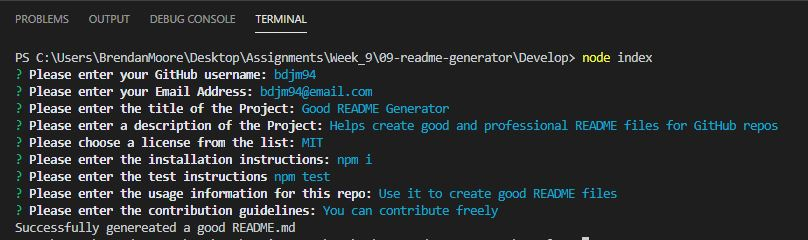
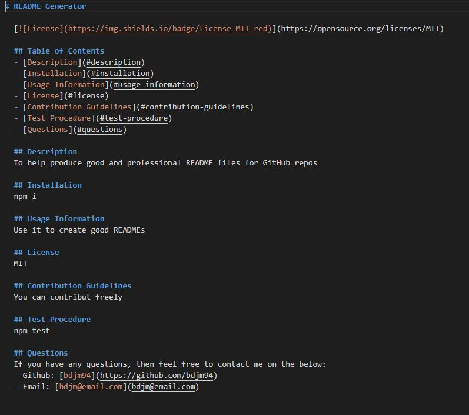
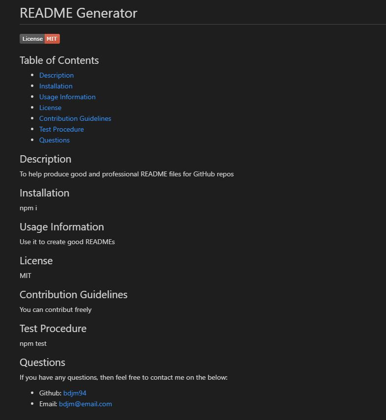

# README Generator

## About
This README Generator is designed to output good and professional README files that can be used for any GitHub repo. The README file that is output will display a hyperlinked table of contents, a description of the project, an installation guide, usage information, the license for the project, contribution guidelines, a test procedure and then a way to contact the project owner either through GitHub or email.

## Functionality
Through the use of node.js (inquirer package) and JavaScript, the README generator provides a prompt of questions for the user. Once the user has answered the questions, a README file will be output and it will contain all the answers from the user.

## README Generator in Use
Terminal with the user prompts

README output with the raw data

Preview of the README in a GitHub repo

## Credits
- [Video of README Generator in Use](https://drive.google.com/file/d/1nVTYdQXvMoMZKJHNXfeCN-Od5-DodV8T/view?usp=sharing)
- [Inquirer.js](https://www.npmjs.com/package/inquirer)